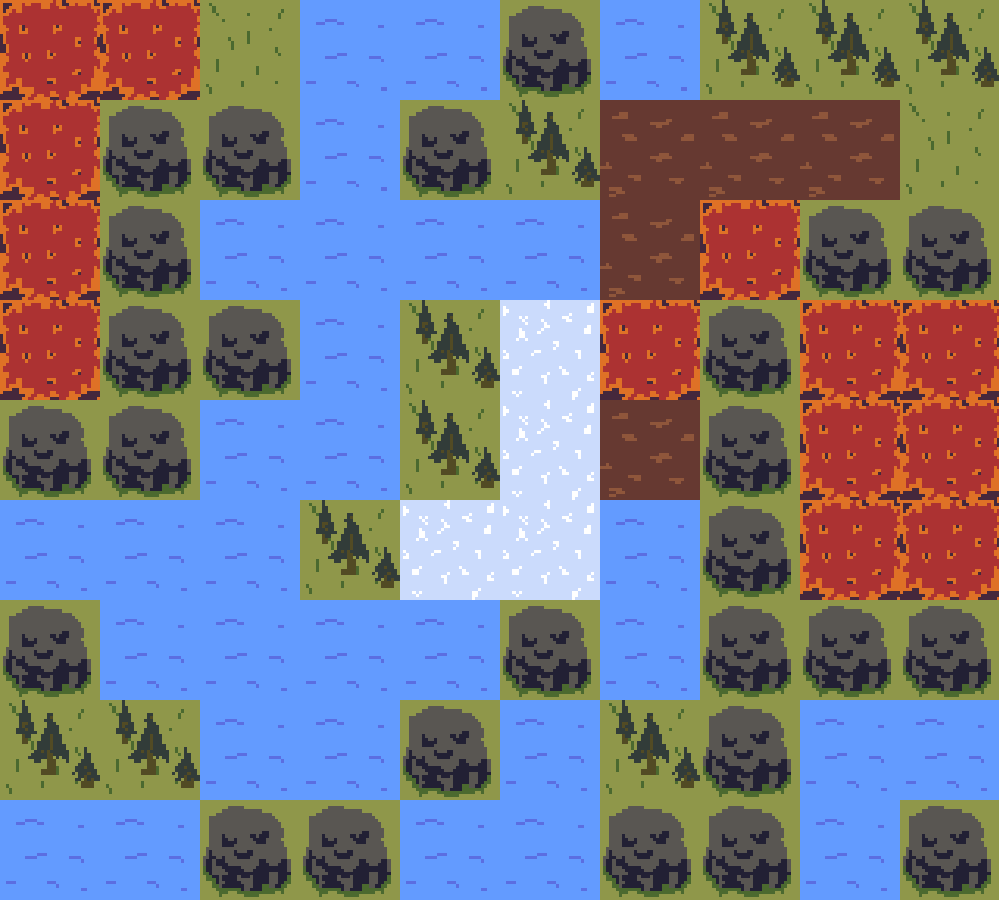

# Systemic

Welcome ! [Systemic](https://deformhead.github.io/Systemic/index.html) is built in plain HTML5/JavaScript with a framework I am developping.

## Overview

> *Systemic games rely on interactions between game objects.*

> *The power of **Systemic Games** is that **reaction rules** are not hardcoded in Systems. **Entities** define their own **reaction rules** and it may lead to **Emergent Gameplays**.*

This is a POC of what could be a **Systemic Game**.

The rules of the world are set like so :

- Some Entities are sensitive to specific elements (`fire`, `water` and/or `ice`)
- Some Entities generate specific elements (`fire`, `water` and/or `ice`)
- When an Entity **sensitive** to a specific element touches (during `n` seconds) an Entity **generating** that element, the first Entity reacts according to its **reaction rules**.

The main goal here is to let Entities interact with each other by defining their own **element awareness**, **element generation** and **reaction rules**.

[Try Systemic](https://deformhead.github.io/Systemic/index.html)

## Theatre

> *[Theatre](https://github.com/theatrejs) is a lightweight, simple and fast javascript game framework.*

This game is built with the [Theatre](https://github.com/theatrejs) game framework generator (see : [`generator-theatre`](https://github.com/theatrejs/generator-theatre)).

## [Change Log](./CHANGELOG.md)

## [License](./LICENSE)
